# 🛡️ devsecops-scan

Pipeline de **segurança automatizada** no GitHub Actions: toda alteração no código passa por **SAST, SCA e DAST** antes de ser considerada apta para entrega. O mesmo vale para a imagem Docker e o Terraform (desafio opcional).


---

## 1. Sobre o projeto

Foi desenvolvida uma **API REST de tarefas** (Python + FastAPI + SQLite) e, em volta dela, uma **pipeline DevSecOps** que analisa automaticamente cada `push` e `pull request`.

A aplicação é simples de propósito. O foco da atividade é mostrar **onde e como a segurança entra no processo de entrega**:

- consultas SQL parametrizadas, validação de entrada (Pydantic) e cabeçalhos HTTP de segurança;
- testes automatizados, incluindo um teste que tenta SQL injection;
- container sem root, com multi-stage build e healthcheck;
- infraestrutura como código (ECR + App Runner na AWS), com criptografia KMS, tags imutáveis e scan no push.

Para provar que a pipeline realmente **bloqueia** código inseguro, o repositório tem um cenário de demonstração (`demo/`) que injeta vulnerabilidades reais e faz a pipeline cair em **FAIL**.

```
devsecops-scan/
├── src/app/main.py              ← aplicação (API de tarefas)
├── tests/test_api.py            ← testes (pytest)
├── requirements.txt             ← dependências de produção (analisadas pelo SCA)
├── requirements-dev.txt         ← dependências de teste
├── Dockerfile                   ← opcional: imagem analisada pelo Trivy
├── terraform/                   ← opcional: IaC analisada pelo Checkov
├── .github/workflows/security.yml  ← a pipeline
├── .zap/rules.tsv               ← classificação de risco do DAST (o que reprova)
├── .semgrepignore
├── demo/                        ← falhas propositais para a demonstração FAIL
└── docs/evidencias/             ← prints das execuções
```

---

## 2. Ferramentas utilizadas

| Ferramenta | Função |
|---|---|
| **Semgrep** | Análise estática do código Python (regras `p/python`, `p/owasp-top-ten`, `p/secrets`) |
| **pip-audit** | Procura CVEs conhecidas nas dependências do `requirements.txt` (base PyPA/OSV) |
| **GitHub Dependency Review** | Em PRs, bloqueia a entrada de dependências novas com vulnerabilidade *high* ou maior |
| **OWASP ZAP** (API Scan) | Ataca a aplicação em execução usando o contrato OpenAPI gerado pelo FastAPI |
| **Trivy** *(opcional)* | Procura CVEs e segredos na imagem Docker construída |
| **Checkov** *(opcional)* | Verifica más configurações no Terraform e no Dockerfile |
| **pytest** | Garante que a aplicação funciona antes de ser analisada |
| **GitHub Actions** | Orquestra tudo e publica relatórios, SARIF e resumo |

---

## 3. Tipo de análise

```
Semgrep            → SAST  (código-fonte, sem executar)
pip-audit          → SCA   (dependências de terceiros)
Dependency Review  → SCA   (dependências novas em pull requests)
OWASP ZAP          → DAST  (aplicação rodando, ataques reais via HTTP)
Trivy              → Container scanning (imagem Docker)   [opcional]
Checkov            → IaC scanning (Terraform/Dockerfile)   [opcional]
```

---

## 4. Funcionamento da pipeline

### O que dispara a pipeline?

O arquivo [`.github/workflows/security.yml`](.github/workflows/security.yml) é acionado automaticamente por:

- **`push`** em qualquer branch;
- **`pull_request`** para a `main`;
- `workflow_dispatch`, para execução manual pela aba *Actions*.

### Em qual etapa ocorre a análise?

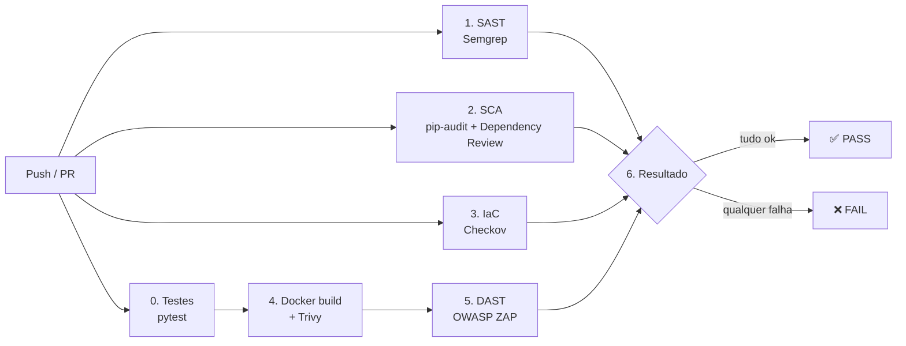

```
Push
 ↓
Pipeline (GitHub Actions)
 ↓
SAST  → Semgrep lê o código-fonte
 ↓
SCA   → pip-audit/Dependency Review verificam as dependências
 ↓
(Docker build → Trivy verifica a imagem · Checkov verifica o Terraform)
 ↓
DAST  → a imagem sobe num container e o OWASP ZAP ataca a API
 ↓
Resultado → PASS / FAIL
```

SAST, SCA e IaC rodam **em paralelo**, logo no início, porque são as análises mais baratas (*shift left*). O DAST vem depois, porque precisa da aplicação construída e em execução. O job **6. Resultado** consolida tudo numa tabela PASS/FAIL no resumo da execução.

### O que acontece quando são encontrados problemas?

| Etapa | Critério de reprovação |
|---|---|
| Semgrep | qualquer finding (`--error`) |
| pip-audit | qualquer dependência com CVE conhecida |
| Dependency Review | dependência nova com severidade **high** ou **critical** |
| Checkov | qualquer check falhando |
| Trivy | CVE **HIGH/CRITICAL** com correção disponível, ou segredo na imagem |
| OWASP ZAP | qualquer alerta de risco **High** no relatório (`report_json.json`), verificado por um *gate* explícito na pipeline. Alertas Medium/Low/Info ficam registrados no relatório e no Summary, sem bloquear. |

Quando algum critério é atingido:

1. o job correspondente fica **vermelho** e o job **Resultado** marca a pipeline como **FAIL**;
2. o motivo aparece no **resumo da execução** (Summary), com a saída de cada ferramenta;
3. os relatórios completos ficam disponíveis como **artifacts** (SARIF, JSON, HTML do ZAP);
4. os findings do Semgrep aparecem na aba **Security → Code scanning**;
5. em pull requests, o Dependency Review comenta no PR, e o check vermelho impede o merge se a *branch protection* estiver ativa.

> 💡 Para bloquear o merge de verdade: *Settings → Branches → Add rule* para `main` → *Require status checks to pass* → selecione **6. Resultado (PASS/FAIL)**.

---

## 5. Resultados

A demonstração foi feita em duas execuções: uma com código vulnerável (**FAIL**) e outra com o código corrigido (**PASS**).

### Como reproduzir

```bash
# Cenário FAIL: injeta vulnerabilidades numa branch separada
git checkout -b demo/vulneravel
bash demo/aplicar-falhas.sh
git add -A && git commit -m "demo: injeta vulnerabilidades"
git push -u origin demo/vulneravel
# abra um Pull Request para a main → pipeline FAIL

# Cenário PASS: a main, com o código seguro
git checkout main   # pipeline PASS
```

O script [`demo/aplicar-falhas.sh`](demo/aplicar-falhas.sh) adiciona:

| Falha injetada | Tipo | Detectada por |
|---|---|---|
| Senha hardcoded (`SENHA_ADMIN`) | CWE-798 Credencial no código | revisão de código (má prática ilustrativa) |
| SQL montado com f-string (`/inseguro/busca`) | CWE-89 SQL Injection | Semgrep, ZAP |
| `subprocess.run(..., shell=True)` com entrada do usuário (`/inseguro/ping`) | CWE-78 Command Injection | Semgrep, ZAP |
| `eval()` com entrada do usuário (`/inseguro/calc`) | CWE-95 Code Injection | Semgrep, ZAP (SSTI blind) |
| `requests==2.25.1` | Dependência com CVEs | pip-audit, Trivy |

### Camada extra: GitHub Push Protection 🔐

Na primeira tentativa de push, o código de demonstração tinha uma chave de API no formato Stripe (`sk_live_…`).
O **GitHub Secret Scanning com Push Protection** recusou o push (`GH013: Push cannot contain secrets`)
**antes mesmo de a pipeline rodar**: o segredo nunca chegou ao repositório remoto.
A correção foi remover o segredo e reescrever o commit, e não liberar a exceção.

Saída do `git push` (trecho):

```
remote: error: GH013: Repository rule violations found for refs/heads/main.
remote: - GITHUB PUSH PROTECTION
remote:     - Push cannot contain secrets
remote:       —— Stripe API Key ——————————————————
remote:        locations:
remote:          - path: demo/rotas_inseguras.py:16
 ! [remote rejected] main -> main (push declined due to repository rule violations)
```

### Resultado obtido — cenário FAIL ❌

**SAST (Semgrep)**: na pipeline, o Semgrep bloqueou o `subprocess.run(..., shell=True)` e comentou direto na linha do PR. Rodando o conjunto completo de regras Python do Semgrep localmente, o código injetado gera estes findings:

```
python.lang.security.audit.formatted-sql-query            → SQL injection
python.sqlalchemy.security.sqlalchemy-execute-raw-query   → SQL injection
python.lang.security.audit.subprocess-shell-true          → command injection
python.lang.security.audit.dangerous-subprocess-use-audit → command injection
python.lang.security.audit.eval-detected                  → code injection
Findings: 5 (5 blocking)
```

**SCA (pip-audit)**, com 3 pacotes vulneráveis:

| Pacote | Versão | Nº de vulnerabilidades | Exemplos |
|---|---|---|---|
| requests | 2.25.1 | várias | CVE-2023-32681, CVE-2024-35195, CVE-2024-47081 |
| urllib3 (transitiva) | 1.26.20 | várias | CVE-2025-50181, CVE-2026-97687 |
| idna (transitiva) | 2.10 | várias | CVE-2024-3651 |

> Repare que `urllib3` e `idna` **nem estão no requirements.txt**: são dependências transitivas trazidas pelo `requests`. É exatamente o tipo de risco que o SCA encontra e que a revisão manual deixa passar.

**DAST (OWASP ZAP)**: o ZAP importou o `openapi.json`, atacou os 33 endpoints/métodos e encontrou **3 alertas High**:

| Risco | Alerta | Endpoint | Evidência |
|---|---|---|---|
| 🔴 High | Remote OS Command Injection | `/inseguro/ping` | payload `host&cat /etc/passwd&` devolveu `root:x:0:0` |
| 🔴 High | SQL Injection | `/inseguro/busca` | `q='` provocou erro do SQLite |
| 🔴 High | Server Side Template Injection (Blind) | `/inseguro/calc` | payload com `sleep 15` executado via `eval()` |

O `eval()` foi encontrado pelo ZAP como injeção de código por tempo de resposta (*blind*): o ataque mandou o servidor "dormir" 15 segundos e mediu o atraso.

📸 *Evidências:*

| | |
|---|---|
| Histórico: branch vulnerável (#29/#30) ❌ × `main` (#28) ✅ | 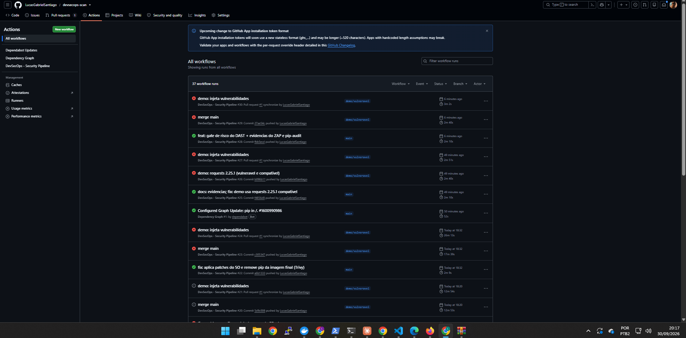 |
| Jobs reprovados na branch vulnerável: SAST, SCA, Trivy e DAST | 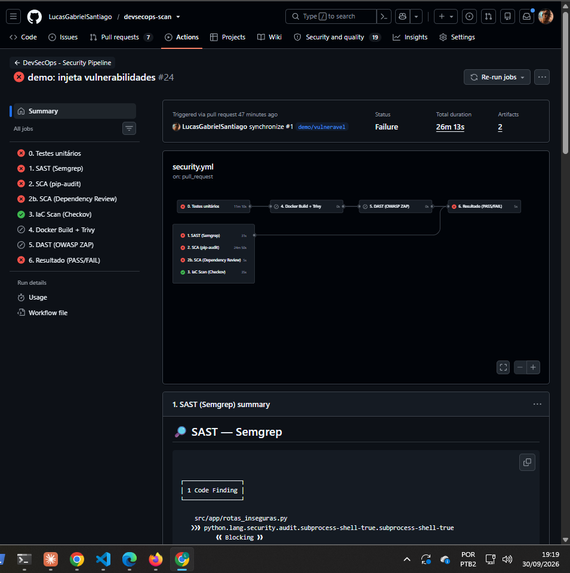 |
| Semgrep comentando direto no PR | 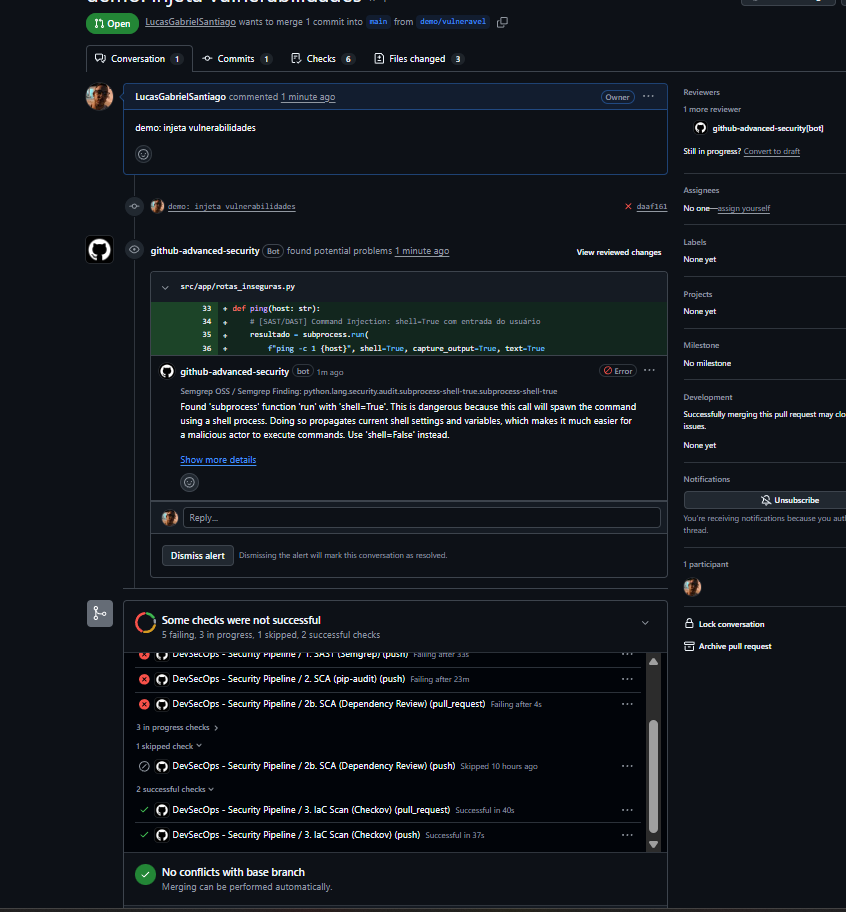 |
| Resumo do Semgrep na execução | 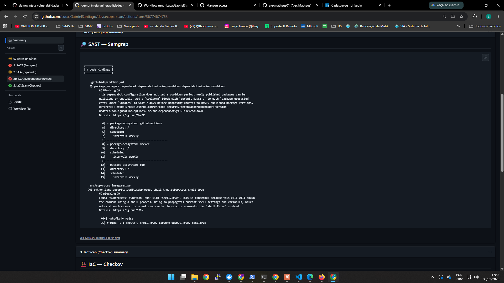 |
| Dependências vulneráveis (pip-audit) | 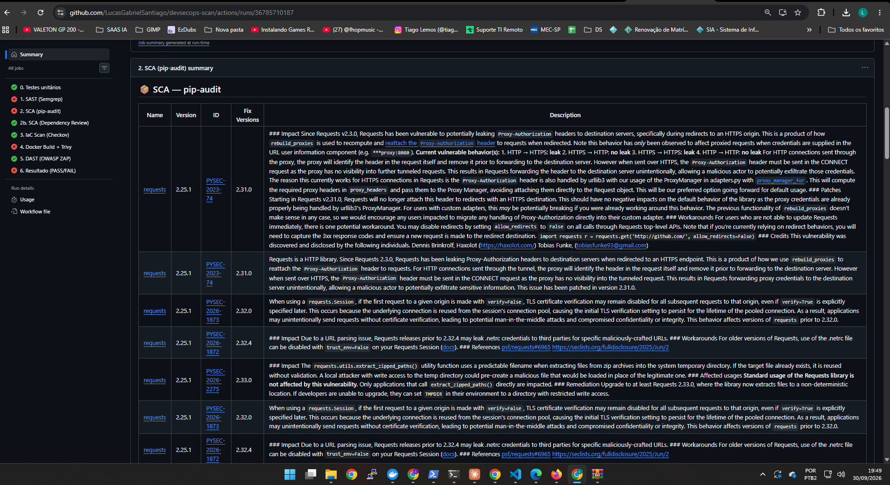 |
| Transitivas vulneráveis: `idna` e `urllib3` | 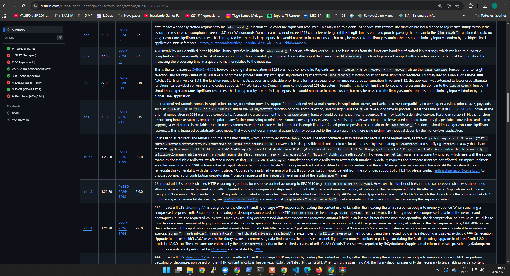 |
| Relatório do ZAP: resumo por risco | 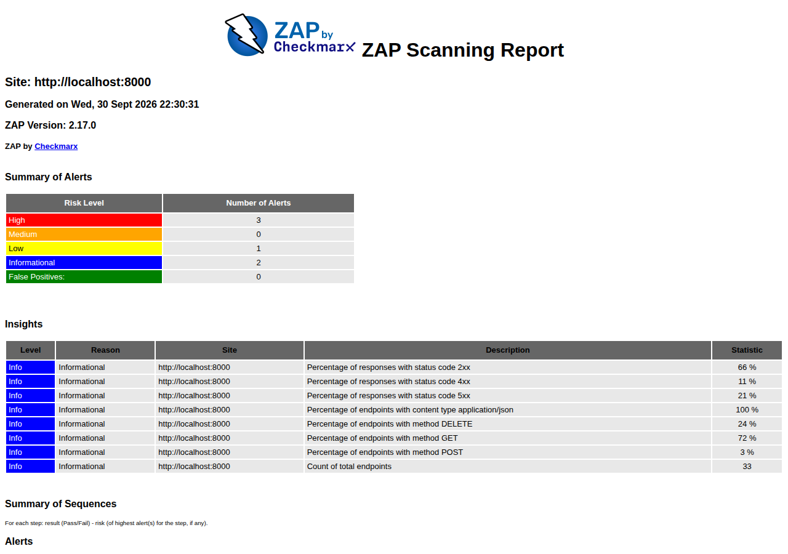 |
| Relatório do ZAP: alertas e evidência | 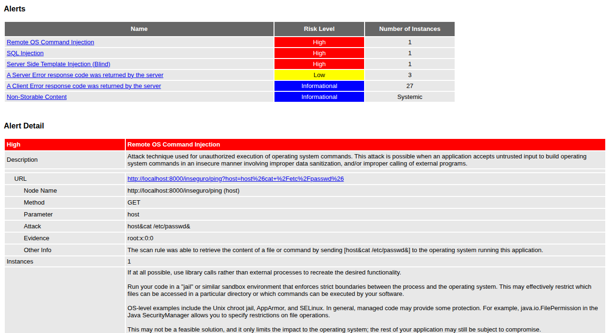 |

### A pipeline também auditou a si mesma 🔁

Até chegar ao resultado final, a pipeline revelou quatro problemas reais no próprio processo:

| Ferramenta | O que encontrou | Correção |
|---|---|---|
| Semgrep | Actions referenciadas por tag mutável (`@v4`), o mesmo vetor do ataque à trivy-action em 2026 | Todas as actions fixadas por SHA de commit |
| Semgrep | Dependabot sem período de *cooldown* | `cooldown: 7 dias` e PRs apenas de segurança |
| Trivy | 6 CVEs HIGH no OpenSSL da imagem base e 4 em bibliotecas embutidas no `pip` | Patches do SO aplicados no build e `pip` removido da imagem final |
| Revisão do relatório do ZAP | O ZAP encontrou 3 alertas High, mas o job passou: o código de saída da action não refletia o risco | *Gate* explícito que lê o `report_json.json` e reprova qualquer alerta High |

Essa última lição é importante: **uma ferramenta de segurança só protege se o resultado dela bloqueia a entrega**. Rodar o scan não basta, é preciso verificar se o gate está funcionando.

As falhas do Trivy não aparecem no SAST nem no SCA: só são vistas ao analisar a **imagem final**. Isso mostra o valor da defesa em camadas.

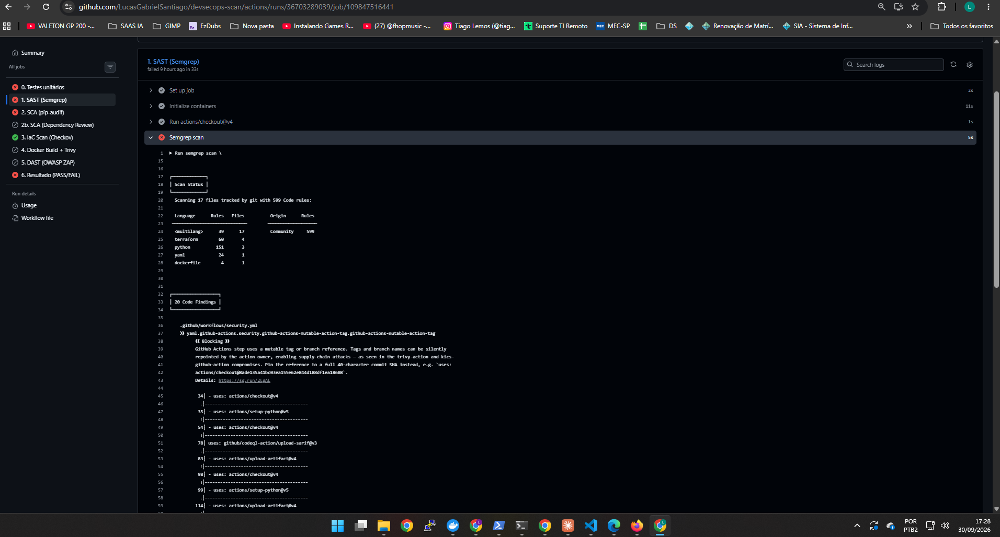

Trecho do relatório do Trivy que reprovou a imagem:

```
api-tarefas (debian 13.7)
Total: 6 (HIGH: 6, CRITICAL: 0)
│ libssl3t64 / openssl / openssl-provider-legacy │ CVE-2026-75804, CVE-2026-84782 │ HIGH │ 3.5.7-1~deb13u2 → 3.5.7-1~deb13u3 │

Python (python-pkg)  — bibliotecas embutidas no pip
Total: 4 (HIGH: 4, CRITICAL: 0)
│ msgpack    │ GHSA-6v7p-g79w-8964 │ 1.1.2  → 1.2.1  │
│ setuptools │ CVE-2025-47273      │ 70.3.0 → 78.1.1 │
│ urllib3    │ CVE-2026-97687, CVE-2026-97689 │ 2.7.0 → 2.8.0 │
```

### Resultado obtido — cenário PASS ✅

Com o código da `main` (consultas parametrizadas, sem `shell=True`/`eval`, dependências atualizadas):

| Etapa | Resultado |
|---|---|
| Testes (pytest) | ✅ 5 passed |
| SAST (Semgrep) | ✅ 0 findings |
| SCA (pip-audit) | ✅ *No known vulnerabilities found* |
| IaC (Checkov) | ✅ Terraform: 15 passed, 0 failed · Dockerfile: 65 passed, 0 failed |
| Imagem (Trivy) | ✅ sem HIGH/CRITICAL corrigíveis |
| DAST (ZAP) | ✅ nenhum alerta FAIL (apenas WARN/informativos) |

📸 *Evidência:*

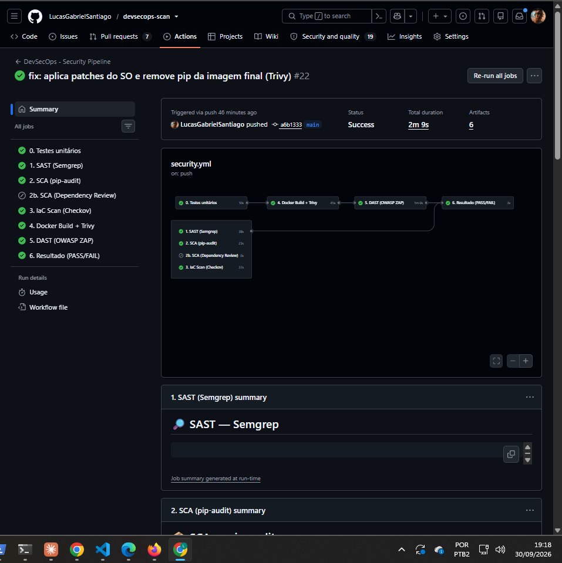

---

## 6. Conclusão

A implementação aplica **DevSecOps** porque a segurança deixa de ser uma etapa manual no fim do projeto e passa a ser **parte automática do fluxo de desenvolvimento**. As mesmas ferramentas rodam em todo `push`, do mesmo jeito, sem depender de alguém lembrar de rodá-las. O resultado é binário (**PASS/FAIL**) e fica registrado, com relatórios auditáveis a cada execução.

O **Shift Left** aparece em três pontos:

1. **A análise acontece no commit, não na produção.** A SQL injection da demonstração foi barrada minutos depois do `push`, antes de qualquer deploy. Corrigir ali custa uma linha de código; em produção custaria um incidente.
2. **As análises mais baratas vêm primeiro.** SAST e SCA rodam em segundos e em paralelo, e o DAST (mais caro) só roda depois do build. O desenvolvedor recebe o retorno mais rápido possível.
3. **Segurança em todas as camadas do que é entregue.** Não só o código (SAST), mas também o que vem de terceiros (SCA), o artefato que vai rodar (Trivy), a infraestrutura (Checkov) e o comportamento real da aplicação (DAST).

A demonstração FAIL → PASS mostra o ciclo completo: **o problema é introduzido, detectado automaticamente, bloqueado e corrigido**, tudo dentro do processo normal de desenvolvimento.

---

### Executar localmente

```bash
python -m venv .venv && source .venv/bin/activate
pip install -r requirements-dev.txt
pytest -v
uvicorn app.main:app --app-dir src --reload   # http://localhost:8000/docs

# ou com Docker
docker build -t api-tarefas . && docker run -p 8000:8000 api-tarefas
```
